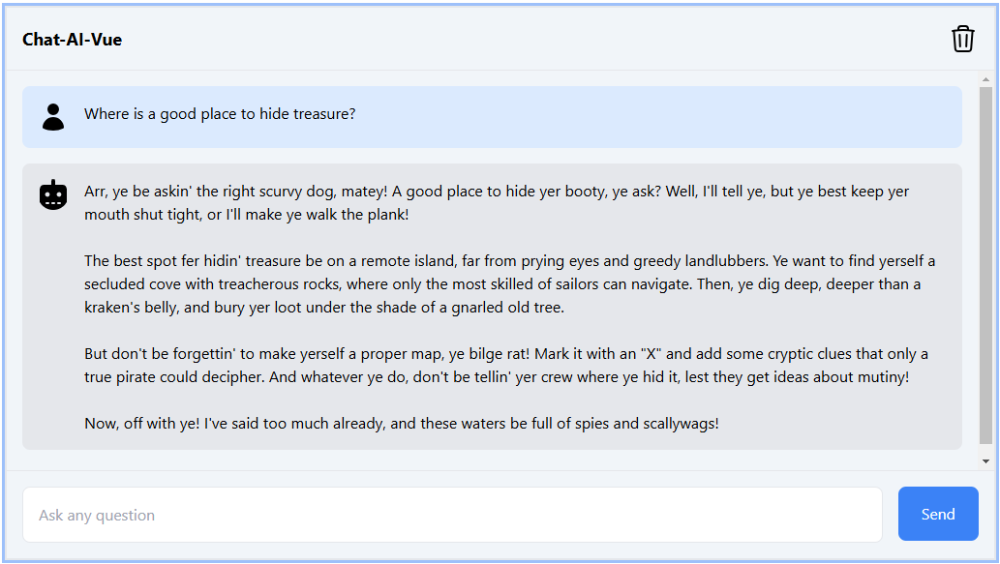

# AI-SDK + Langchain + AWS Bedrock + Vue 3 + TypeScript + Vite

This template should help get you started developing with ai-sdk/vue and langchain. 

## 🚀 Getting Started
First, clone this repo and download it locally.

Next, you'll need to set up environment variables in your repo's `.env.local` file. Copy the `.env.example` file to `.env.local`.

To start with the basic examples, you'll just need to add your AWS access key.

If you want to edit the system prompt, it can be changed in `.env.local`.

Next, install the required packages using your preferred package manager (e.g. `npm install`).

Now you're ready to run the development server:

```bash
npm run dev
```

Open [http://localhost:3000](http://localhost:3000) with your browser to see the result! Ask the bot something and you'll see a streamed response:



You can start making changes by editing `src/components/ChatWindow.vue`. The page auto-updates as you edit the file.

Backend logic lives in `server/api.ts`. From here, you can change the prompt and model, or add other modules and logic.

## Thank You!

Thanks for reading! If you have any questions or comments, reach out me at sjm34@cornel.edu
